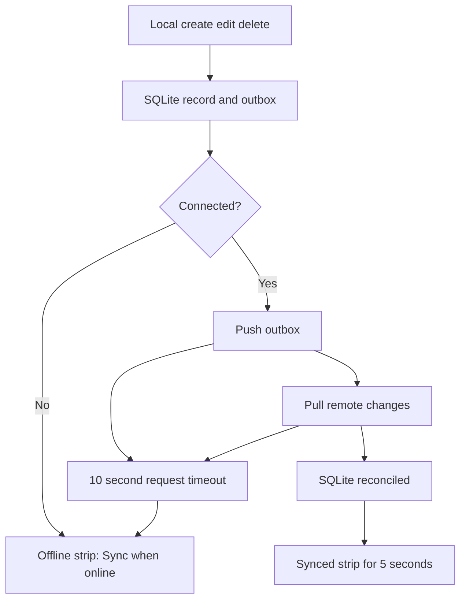

# Mobile Sync Status Spec

**Status:** Implemented locally; device visual acceptance pending
**Scope:** Mobile sync transport and status UI only
**Production touched:** No

## Goal

Stop stalled syncs from leaving the app in a permanent loading state. Communicate
offline sync status calmly without blocking the user or implying that locally saved
changes are lost.

## User Experience

| State | UI | Lifetime |
| --- | --- | --- |
| Syncing | Spinner and `Syncing...` | Until the request resolves, fails, or times out. |
| Success | Check icon and `Synced` | Five seconds. |
| Offline | Cloud-off icon and `Changes saved here. Sync when online.` | Five seconds, then a retry dot remains on manual sync controls. |
| Attention | Alert icon and a non-blocking reconciliation message. | Five seconds, then a retry dot remains on manual sync controls. |

The status strip appears immediately below the shared mobile header. It has muted
colors, no modal alert, and does not prevent offline data entry.

After an offline or attention result, Dashboard and Profile show a small destructive
dot on their manual sync control. The dot clears when the user manually retries or
when a later automatic sync succeeds.

## Transport Behavior

- Every mobile API request has a 10-second `AbortController` timeout.
- A timeout maps to `MobileConnectionError('server_unavailable', ...)`.
- Sync checks `NetInfo` first. An explicitly disconnected device moves directly to
  the Offline state instead of starting a request.
- Offline writes remain local SQLite transactions and remain in the outbox.

## Shared State

`SyncProvider` sits inside `SessionProvider` and owns the automatic foreground and
network-recovery sync triggers. All `useSync()` callers consume the same state, so a
manual sync on Dashboard or Profile updates the single application-level status strip.



```text
Dashboard/Profile/manual action     App foreground/network restore
               |                               |
               +---------- SyncProvider --------+
                              |
                SQLite outbox <-> mobile API
                              |
                  shared status strip in AppShell
```

## Changed Areas

- `apps/mobile/src/sync/api.ts`: abortable request timeout.
- `apps/mobile/src/sync/use-sync.ts`: shared sync provider and friendly states.
- `apps/mobile/app/_layout.tsx`: mount the provider inside the session boundary.
- `apps/mobile/src/ui/app-shell.tsx`: render the application-level status strip.
- `apps/mobile/app/(tabs)/dashboard.tsx` and `apps/mobile/app/(tabs)/more.tsx`:
  retain manual sync actions without permanent button loading states.

## Non-Goals

- No retry scheduler, background service, sync protocol, outbox, or server changes.
- No change to authentication rules, sync authorization, database schema, or local
  write behavior.
- No blocking error dialogs for connection failures.

## Verification

1. Mobile typecheck passes.
2. A disconnected device shows the Offline state without an indefinite spinner.
3. A reachable but stalled server reaches the Offline state after ten seconds.
4. All result states clear after five seconds.
5. An unsuccessful sync leaves a retry dot on Profile and Dashboard until retry or success.
6. Profile and Dashboard manual sync actions update the same status strip.
7. Existing offline writes stay available locally and queue for later sync.
