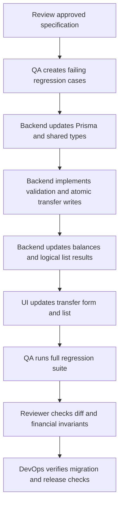

# Implementation plan: transaction flow correction

Spec: `SPEC-transaction-fix.md`
Lead: None assigned; the user controls project decisions

This is historical planning context, not task status. Consult the immutable reports under `.agents/reports/` for current evidence and release-gate state.

## Dependency plan



### User Flow

```text
  ╔══════════════════════════════════════╗
  ║ The user approves the transaction spec ║
  ╚══════════════════════════════════════╝
                    │
                    ▼
  ┌──────────────────────────────────────┐
  │ QA creates a failing regression case │
  └──────────────────────────────────────┘
                    │
                    ▼
  ┌──────────────────────────────────────┐
  │ Backend creates two linked transfer  │
  │ entries in one database transaction  │
  └──────────────────────────────────────┘
                    │
                    ▼
  ┌──────────────────────────────────────┐
  │ Backend recalculates balances and    │
  │ groups the transfer for the client   │
  └──────────────────────────────────────┘
                    │
                    ▼
  ┌──────────────────────────────────────┐
  │ UI shows From account → To account   │
  └──────────────────────────────────────┘
                    │
                    ▼
  ┌────────────── Tests pass? ───────────┐
  └──────────────────────────────────────┘
          │ Yes                    │ No
          ▼                        ▼
  ┌──────────────────┐   ┌──────────────────────┐
  │ Reviewer and      │   │ Return the failure to │
  │ DevOps verify     │   │ the owning agent    │
  └──────────────────┘   └──────────────────────┘
```

## Ordered tasks

### Task 1: Build the regression test seam

Owner: `qa-agent`
Files: test files and approved test configuration only
Confidence: 90%. The required behaviors are clear, but the repository currently has no test framework.

- Inspect the existing package manifests for an available runner.
- If no runner exists, stop and request approval before adding dependencies.
- Add failing tests for balance signs, transfer conservation, invalid transfer fields, and ownership filtering.
- Record the exact red test command and expected failure.

Gate: The expected failing behavior is recorded before implementation.

### Task 2: Extend the shared transfer contract

Owner: `backend-agent`
Files:

- `packages/database/prisma/schema.prisma`
- `packages/database/prisma/migrations/**`
- `packages/types/src/models.ts`
- `packages/types/src/schemas.ts`

Confidence: 94%. The linked-entry model and same-currency policy are approved.

- Add nullable transfer group and role fields for legacy compatibility.
- Add the transfer role enum and indexes/constraints.
- Change shared input types to express the type-specific transfer payload.
- Keep positive amounts and existing Decimal/string conventions.
- Generate a migration without backfilling unknown destinations.

Gate: Prisma/schema validation and shared typecheck pass. Migration SQL is reviewed before applying it.

### Task 3: Implement atomic transaction operations

Owner: `backend-agent`
Files:

- `apps/web/src/app/api/transactions/route.ts`
- `apps/web/src/app/api/transactions/[id]/route.ts`
- `apps/web/src/lib/validations.ts`

Confidence: 91%. The required validation rules are clear; exact partial-update handling needs careful implementation.

- Validate income, expense, and transfer as separate input shapes.
- Verify account and category ownership and category type.
- Verify same currency and distinct transfer accounts.
- Create the outgoing and incoming entries atomically.
- Resolve transfer groups for update and delete.
- Fix the collection endpoint account ownership filter.
- Reject invalid bucket and category combinations.

Gate: Focused API tests pass, including rollback and foreign-ID cases.

### Task 4: Make all calculations use transfer direction

Owner: `backend-agent`
Files:

- `apps/web/src/lib/queries.ts`
- `packages/types/src/models.ts` if a returned view type is needed

Confidence: 93%. The current calculation paths are known from the source review.

- Add outgoing transfer subtraction and incoming transfer addition.
- Keep transfers out of income, expense, report, trend, and budget aggregates.
- Ensure same-currency total conservation.
- Group transfer legs into one logical list result.
- Preserve legacy unresolved outgoing behavior.

Gate: Domain and aggregation tests pass without changing UI code.

### Task 5: Update the client transaction flow

Owner: `ui-ux-agent`
Files:

- `apps/web/src/components/transactions/transaction-form.tsx`
- `apps/web/src/components/transactions/transactions-manager.tsx`
- `apps/web/src/components/transactions/transaction-list.tsx`
- `apps/web/src/lib/meta.ts`
- `apps/web/src/components/dashboard/floating-actions.tsx`

Confidence: 96%. The required visible states are explicit and the current components are identified.

- Add From and To account selectors for transfers.
- Hide category and bucket for transfers.
- Prevent same-account and different-currency choices.
- Clear stale category, bucket, and transfer fields when type changes.
- Display one transfer event with direction and both account names.
- Preserve loading, error, edit, delete, and empty states.
- Use local date-only values.

Gate: UI tests/typecheck pass and the flow is manually checked in the running app if available.

### Task 6: Full QA and independent review

Owners: `qa-agent`, then `reviewer-agent`
Files: test files and reports only
Confidence: 98%. The acceptance matrix is defined in the specification.

- Run the complete transaction regression matrix.
- Run typecheck, lint, build, and available tests.
- Separate passed, failed, blocked, and untested checks.
- Reviewer checks security, migration safety, financial invariants, scope, and requirement compliance.

Gate: No blocking reviewer findings remain.

### Task 7: Release verification

Owner: `devops-agent`
Files: delivery configuration and release report only
Confidence: 95%. Existing commands are known, but build/lint environment failures need fresh verification.

- Validate migration application and rollback guidance.
- Run the actual repository checks.
- Verify environment-variable documentation.
- Confirm preview deployment behavior before production deployment.
- Do not deploy without explicit user approval.

## Risks and mitigations

| Risk | Mitigation |
|---|---|
| Existing transfer rows have no destination | Preserve them as unresolved legacy outgoing rows; never infer a destination |
| Transfer creates only one leg | Use one Prisma database transaction and rollback tests |
| Transfer appears twice in the UI | Group by transfer ID before returning list data |
| Type changes leave stale fields | Use discriminated validation and clear client fields |
| Cross-user account access | Keep ownership predicates on every list and mutation path |
| Mixed currencies corrupt totals | Reject cross-currency transfers until exchange-rate support exists |
| No test framework exists | QA requests dependency approval before installing one |
| Schema migration breaks production data | Review SQL, count legacy rows, back up, and test rollback guidance |
